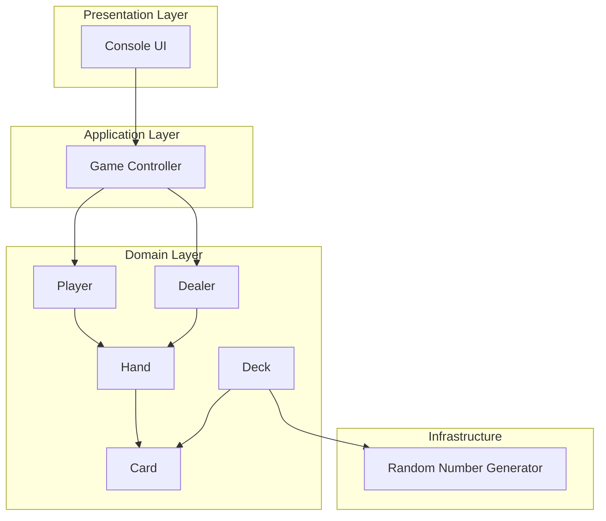

# System Architecture

## Overview

The Blackjack game follows a layered architecture with clear separation of concerns.

## Architecture Diagram

## Layer Descriptions

| Layer | Responsibility |
|-------|----------------|
| Presentation | Console input/output, user interaction |
| Application | Game flow control, rule enforcement |
| Domain | Core entities: Card, Deck, Hand, Player, Dealer |
| Infrastructure | Random number generation, utilities |
