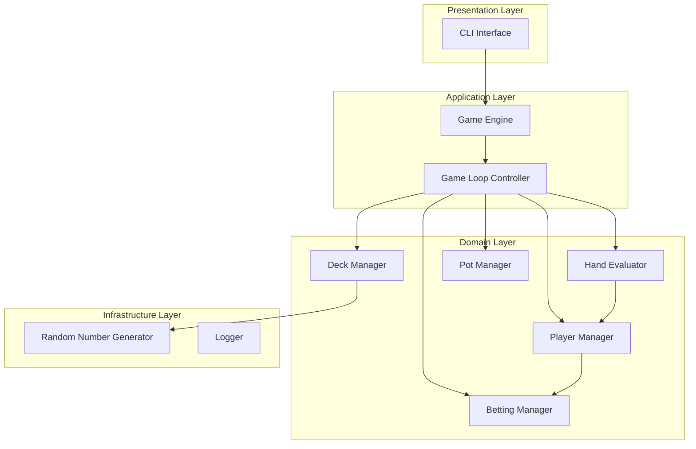
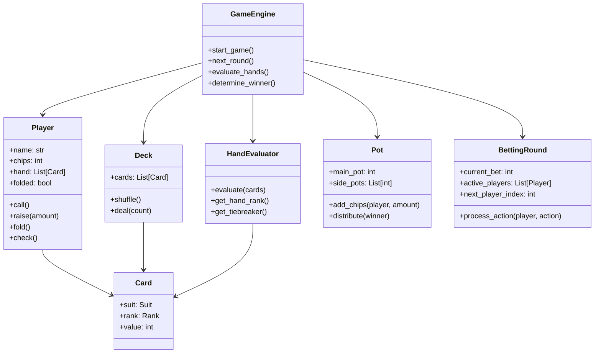
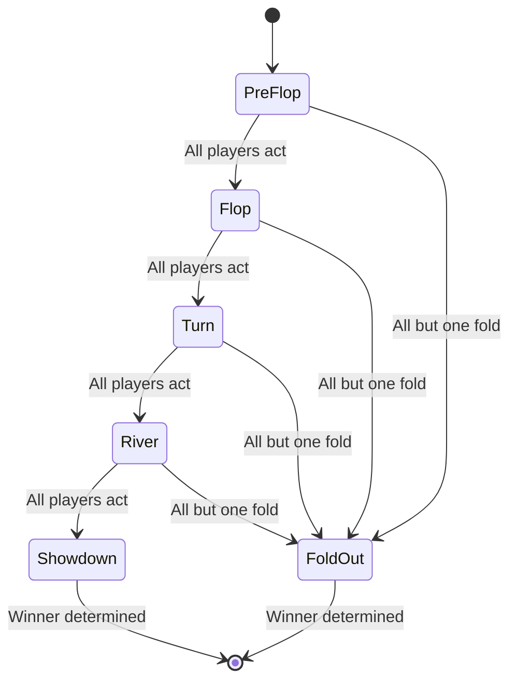
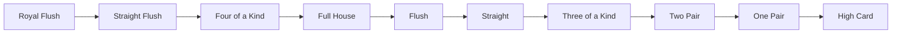
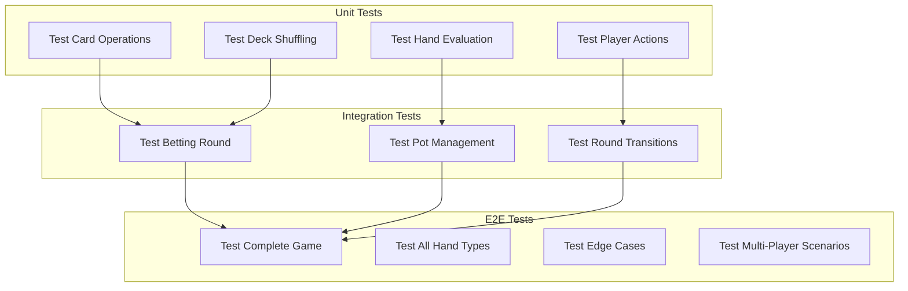

# Texas Hold'em Poker Game - Architecture & System Design

## System Overview

A command-line Texas Hold'em poker game supporting multiple players with full game mechanics including betting rounds, hand evaluation, and pot management.

---

## Architectural Diagram



---

## Component Architecture



---

## Game Flow State Machine



---

## Hand Ranking System



### Hand Values (for comparison)
| Rank | Value | Description |
|------|-------|-------------|
| Royal Flush | 900 | A-K-Q-J-10, same suit |
| Straight Flush | 800 | 5 consecutive, same suit |
| Four of a Kind | 700 | 4 cards same rank |
| Full House | 600 | 3 of a kind + pair |
| Flush | 500 | 5 cards same suit |
| Straight | 400 | 5 consecutive cards |
| Three of a Kind | 300 | 3 cards same rank |
| Two Pair | 200 | 2 pairs |
| One Pair | 100 | 1 pair |
| High Card | 0 | No combination |

---

## Data Models

### Card
```python
Card {
    suit: Suit (Hearts, Diamonds, Clubs, Spades)
    rank: Rank (2-10, J, Q, K, A)
    value: int (2-14, where A=14)
}
```

### Player
```python
Player {
    id: str
    name: str
    chips: int
    hand: List[Card] (2 cards)
    folded: bool
    current_bet: int
    is_dealer: bool
    is_big_blind: bool
    is_small_blind: bool
}
```

### Game State
```python
GameState {
    players: List[Player]
    community_cards: List[Card] (0-5 cards)
    deck: Deck
    pot: Pot
    current_round: Round (PreFlop, Flop, Turn, River, Showdown)
    current_bettor: Player
    current_bet_amount: int
    min_bet: int
    max_bet: int
}
```

---

## Testing Architecture



---

## File Structure

```
texas_holdem/
├── src/
│   ├── __init__.py
│   ├── cards.py          # Card, Suit, Rank, Deck classes
│   ├── player.py         # Player class and actions
│   ├── hand_evaluator.py # Hand ranking and evaluation
│   ├── pot.py            # Pot and side pot management
│   ├── betting.py        # Betting round management
│   ├── game.py           # Main game engine
│   └── cli.py            # Command-line interface
├── tests/
│   ├── __init__.py
│   ├── test_cards.py
│   ├── test_hand_evaluator.py
│   ├── test_player.py
│   ├── test_pot.py
│   ├── test_betting.py
│   ├── test_game.py
│   └── e2e/
│       ├── __init__.py
│       ├── test_complete_games.py
│       ├── test_hand_scenarios.py
│       └── test_edge_cases.py
├── ARCHITECTURE.md
├── README.md
├── requirements.txt
└── pytest.ini
```

---

## Key Design Decisions

1. **Deterministic RNG for Testing**: The deck uses a configurable random seed, enabling reproducible test scenarios.

2. **Side Pot Support**: Full implementation of side pots for all-in scenarios.

3. **Position-Based Blinds**: Small blind and big blind rotate each hand.

4. **Hand Evaluation Efficiency**: Uses pre-computed rank values for O(1) hand comparisons.

5. **Action Validation**: All player actions are validated against game state before execution.

6. **Clean Separation**: Strict separation between game logic and CLI presentation.
