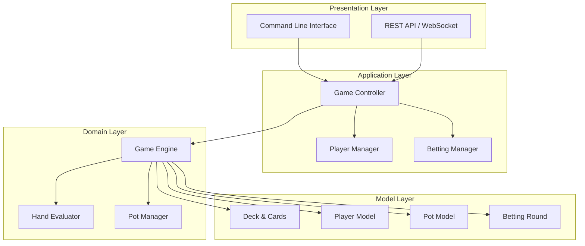
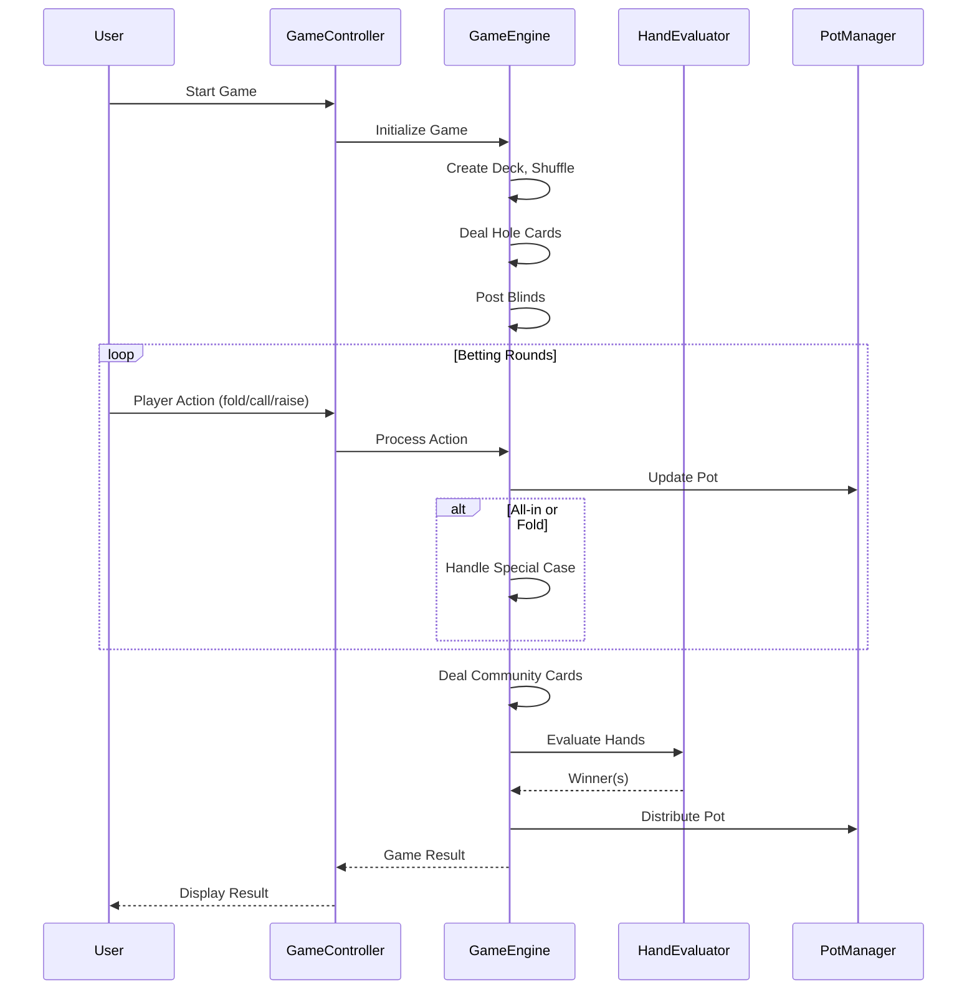
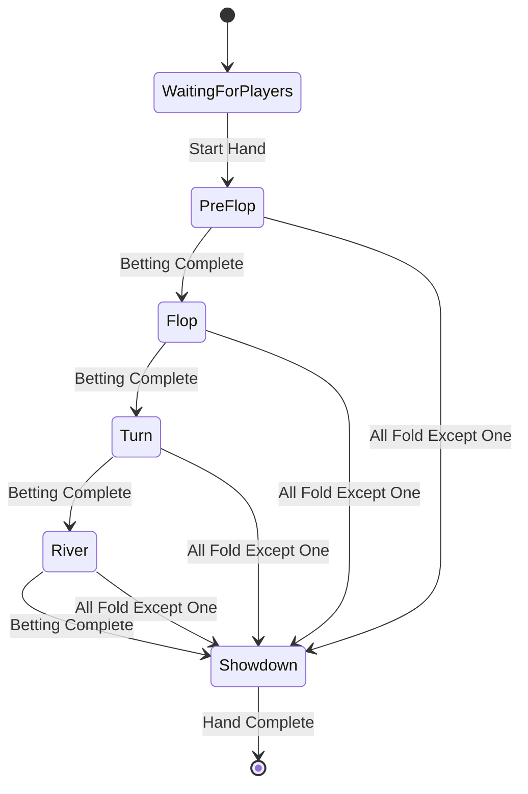
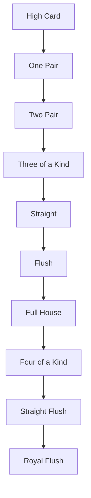

# Texas Hold'em Poker - System Architecture

## High-Level Architecture Diagram

```mermaid
graph TB
    subgraph "Presentation Layer"
        CLI[Command Line Interface]
        API[REST API / WebSocket]
    end
    
    subgraph "Application Layer"
        GameController[Game Controller]
        PlayerManager[Player Manager]
        BettingManager[Betting Manager]
    end
    
    subgraph "Domain Layer"
        GameEngine[Game Engine]
        HandEvaluator[Hand Evaluator]
        PotManager[Pot Manager]
    end
    
    subgraph "Model Layer"
        Deck[Deck & Cards]
        Player[Player Model]
        Pot[Pot Model]
        BettingRound[Betting Round]
    end
    
    CLI --> GameController
    API --> GameController
    GameController --> GameEngine
    GameController --> PlayerManager
    GameController --> BettingManager
    GameEngine --> HandEvaluator
    GameEngine --> PotManager
    GameEngine --> Deck
    GameEngine --> Player
    GameEngine --> Pot
    GameEngine --> BettingRound
```

## Component Interaction Flow

```mermaid
sequenceDiagram
    participant U as User
    participant GC as GameController
    participant GE as GameEngine
    participant HE as HandEvaluator
    participant PM as PotManager
    
    U->>GC: Start Game
    GC->>GE: Initialize Game
    GE->>GE: Create Deck, Shuffle
    GE->>GE: Deal Hole Cards
    GE->>GE: Post Blinds
    
    loop Betting Rounds
        U->>GC: Player Action (fold/call/raise)
        GC->>GE: Process Action
        GE->>PM: Update Pot
        alt All-in or Fold
            GE->>GE: Handle Special Case
        end
    end
    
    GE->>GE: Deal Community Cards
    GE->>HE: Evaluate Hands
    HE-->>GE: Winner(s)
    GE->>PM: Distribute Pot
    GE-->>GC: Game Result
    GC-->>U: Display Result
```

## Game State Machine

```mermaid
stateDiagram-v2
    [*] --> WaitingForPlayers
    WaitingForPlayers --> PreFlop: Start Hand
    PreFlop --> Flop: Betting Complete
    Flop --> Turn: Betting Complete
    Turn --> River: Betting Complete
    River --> Showdown: Betting Complete
    Showdown --> [*]: Hand Complete
    
    PreFlop --> Showdown: All Fold Except One
    Flop --> Showdown: All Fold Except One
    Turn --> Showdown: All Fold Except One
    River --> Showdown: All Fold Except One
```

## Hand Ranking Hierarchy

```mermaid
graph TD
    A[High Card] --> B[One Pair]
    B --> C[Two Pair]
    C --> D[Three of a Kind]
    D --> E[Straight]
    E --> F[Flush]
    F --> G[Full House]
    G --> H[Four of a Kind]
    H --> I[Straight Flush]
    I --> J[Royal Flush]
```
